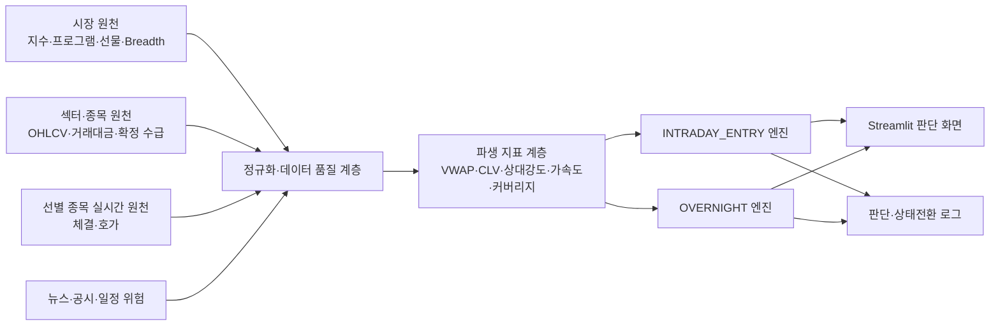
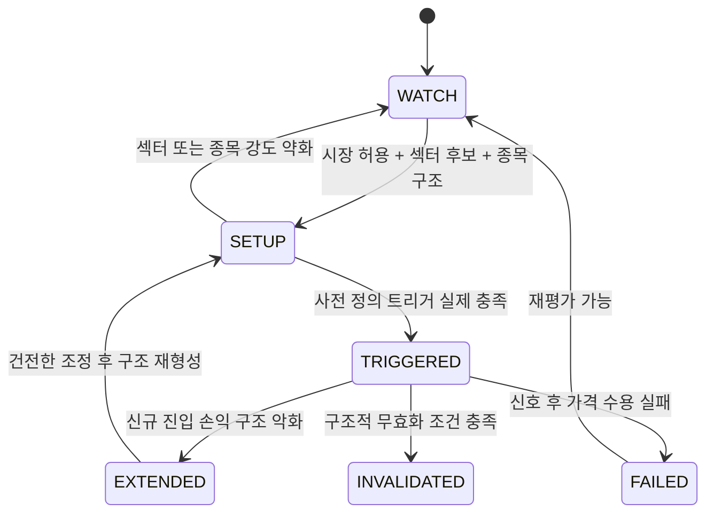

# 장중 베팅·오버나이트 판단 엔진 개발 기획서

- 문서 상태: Draft v1.0
- 작성 기준일: 2026-08-01 (KST)
- 대상 저장소: `Gemini assistant`
- 제품 범위: 한국 주식시장 분석 및 의사결정 지원
- 실행 원칙: 읽기 전용 시세 분석. 자동 주문은 범위에 포함하지 않는다.
- 전략 원칙: 백테스트로 임계값을 최적화하지 않고, 시장 구조에 근거한 전문가 규칙과 실시간 관측으로 판단한다.
- Phase 1 현황: `API_PROBE_STATUS.md` 참조
- Phase 2 공통 엔진 현황: `PHASE2_CORE_STATUS.md` 참조
- Phase 3 입력 연결 현황: `PHASE3_INTEGRATION_STATUS.md` 참조
- Phase 3 파생값·신호 현황: `PHASE3_FEATURE_SIGNAL_STATUS.md` 참조
- 판단 저장·기존 UI 통합 현황: `PHASE4_PERSISTENCE_UI_STATUS.md` 참조

## 1. 문서 목적

이 문서는 사용자가 장중과 장 마감 후에 실제로 답을 얻을 수 있도록 현재 프로젝트를 확장하기 위한 제품·데이터·분석·화면·개발·검수 기준을 정의한다.

핵심 질문은 다음 두 가지다.

1. **장중 베팅 판단**: 지금 신규 매수를 시도하기 좋은 시장인가? 어느 섹터가 강해지고 있으며, 그 안에서 어떤 종목이 진입 조건을 충족했는가?
2. **오버나이트 판단**: 오늘 마감 상태가 다음 거래일까지 보유하기 적합한가? 종가 신규 진입과 기존 보유를 각각 어떻게 처리해야 하는가?

이 문서는 기존 연구·백테스트 문서를 대체하지 않는다. 기존 연구 코드는 보존하되, 이번 실시간 판단 엔진과 입력·출력·판단 근거를 섞지 않는다.

## 2. 제품 목표와 비목표

### 2.1 목표

- 시장을 `ALLOW`, `SELECTIVE`, `BLOCK`으로 분류한다.
- 장중 강해지는 섹터와 약해지는 섹터를 구분한다.
- 단일 대형주 독주와 섹터 전반의 자금 확산을 구분한다.
- 종목을 `WATCH → SETUP → TRIGGERED` 상태로 추적하고 추격 금지·실패·무효 상태를 별도로 표시한다.
- 종가 신규 진입과 기존 포지션 보유를 분리하여 판단한다.
- 실제 순매수 데이터, 가격 기반 추정 흐름, 단순 거래 활동을 명확히 구분한다.
- 모든 판단에 지지 근거, 반대 증거, 무효화 조건, 데이터 한계를 함께 표시한다.
- 원시 데이터와 파생 계산값, 최종 판단을 추적 가능하게 저장한다.

### 2.2 비목표

- 자동 주문·자동 손절·계좌 포지션 변경
- 수익률 보장 또는 근거 없는 상승 확률 산출
- 백테스트를 통한 임계값·점수 최적화
- Top 60을 전체 시장으로 간주하는 시장 판단
- CLV 기반 추정 흐름을 실제 투자자 순매수 금액으로 표현하는 것
- 확인되지 않은 API 필드·단위·호출 한도를 확정값으로 사용하는 것
- 체결과 호가만으로 주문 취소와 진성 소진을 완벽하게 복원하는 것

## 3. 사용자에게 제공할 최종 결과

### 3.1 장중 결과

장중 화면은 다음 질문에 한 화면 안에서 답해야 한다.

- 현재 시장 허가 상태는 무엇인가?
- 상태가 직전 평가보다 좋아졌는가, 나빠졌는가?
- 현재 `LEADING` 또는 `EMERGING` 섹터는 무엇인가?
- 섹터 강세가 구성 종목 전반으로 확산됐는가?
- 실제 진입 신호가 발생한 종목은 무엇인가?
- 해당 종목은 이미 `EXTENDED` 상태인가?
- 진입 근거와 반대 증거는 무엇인가?
- 어떤 가격·시장·섹터 조건에서 분석이 무효가 되는가?

### 3.2 장 마감 결과

장 마감 화면은 다음 두 결정을 분리해 제공한다.

| 결정 | 의미 | 출력 상태 |
|---|---|---|
| `CLOSE_NEW_ENTRY` | 오늘 마감 기준으로 새 포지션을 만들어 다음 거래일까지 보유 | `ALLOWED`, `SELECTIVE`, `BLOCKED` |
| `HOLD_EXISTING` | 장중에 만든 기존 포지션을 다음 거래일까지 유지 | `HOLD`, `REDUCE`, `EXIT` |

마감 판단은 시장 전체, 섹터, 종목, 이벤트 위험을 함께 보여주고 어느 한 축의 단일 신호만으로 전체 결론을 만들지 않는다.

## 4. 현재 프로젝트 현황

### 4.1 현재 실행 구조

현재 `main.py`는 대략 다음 순서로 실행된다.

1. `StockCrawler`로 시장·종목·투자자 데이터 수집
2. 기존 종가베팅 스캐너 실행
3. 뉴스 수집
4. 시장강도 분석
5. 종합 스코어링
6. 엑셀·텔레그램 결과 생성

GitHub Actions는 `main.py`를 실행한 뒤 `stock_data.db`와 보고서를 저장소에 반영한다. Streamlit 앱은 원격 저장소의 최신 DB를 내려받아 표시할 수 있다.

### 4.2 현재 주요 모듈

| 파일 | 현재 역할 | 이번 개발에서의 처리 |
|---|---|---|
| `crawler.py` | 거래대금 상위 종목, 현재가, 종목별 투자자 수급, 섹터 분류, `daily_stocks` 저장 | 기존 기능 보존. 데이터 출처·가용 시각·단위 메타데이터 강화 |
| `market_strength.py` | 프로그램·선물·베이시스를 이용한 0~100 시장강도 점수 | 원시 수집은 재사용. 단일 점수 중심 화면을 시장 상태·근거·반대 증거 구조로 전환 |
| `program_ws_collector.py` | KIS 프로그램 실시간 데이터를 지정 시각에 저장 | 핵심 시장 원천으로 재사용. 원문 필드·단위 검증 필요 |
| `sector_flow_collector.py` | Top 60 종목 분봉을 방향성 거래대금으로 합산 | 기존 `signed_flow`를 실제 자금 유입으로 사용하지 않음. CLV 기반 프록시와 커버리지 중심으로 개편 |
| `kiwoom_market_collector.py` | 현재 거래일 14:30·15:30 프로그램·베이시스 저장 | 현재 세션 보조 원천으로 유지. 역사 조회 금지 제약 보존 |
| `close_bet_scanner.py` | 대형주 일봉 기술조건 기반 종가 후보 탐색 | 후보 생성기 중 하나로만 유지. 최종 시장·섹터 허가와 분리 |
| `close_bet_model3_scanner.py` | RSI·MACD 전환 종가 후보 탐색 | 기존 실험 후보로 격리. 새 엔진의 핵심 판단식으로 승격하지 않음 |
| `close_bet_staged/` | 단계형 종가베팅 연구·규칙 모델 | 사용 가능한 계산 모듈은 검토하되 백테스트·학습 결과를 새 휴리스틱의 근거로 자동 사용하지 않음 |
| `app.py` | 13개 탭의 Streamlit 대시보드 | 기존 탭을 유지하면서 시장·섹터·종가 화면을 새 엔진 결과로 점진 교체 |

### 4.3 현재 데이터와 한계

| 데이터 | 현재 상태 | 핵심 한계 |
|---|---|---|
| `daily_stocks` | 거래대금 상위 활성 종목과 종목별 수급 저장 | 시장 전체가 아니며 세션별 스냅샷이다 |
| `market_strength_snapshots` | 시장 분석 시점별 프로그램·선물·베이시스 저장 | 현재 점수는 종가베팅 환경 휴리스틱이며 다음 날 확률이 아니다 |
| `market_program_snapshots` | WebSocket 프로그램 스냅샷 | 실제 원문 필드와 금액 단위를 운영 환경에서 재검증해야 한다 |
| `sector_flow_windows` | Top 60 기반 섹터별 방향성 거래대금 | 생존자·선택 편향이 있고 기존 `signed_flow`는 실제 순매수가 아니다 |
| 종목 투자자 수급 | 장 마감 후 외국인·기관 금액 사용 가능 | 장중 실시간 판단에 사용하면 안 된다 |
| 시장 Breadth | 전체 시장 기준 미확정 | Top 60 참여도를 시장 전체 상승·하락 종목 수로 대체하면 안 된다 |
| 체결·호가 | 전용 저장 구조 없음 | 방향, 패킷 순서, 시각 정밀도, 구독 한도 검증이 필요하다 |
| 섹터 매핑 | 네이버 업종과 일부 수동 보정 | 시점별 구성 이력과 전체 구성 종목·거래대금 커버리지 부족 |

### 4.4 보존 원칙

- 현재 작업 트리에 존재하는 사용자 변경은 덮어쓰지 않는다.
- 기존 테이블을 즉시 파괴적으로 변경하지 않는다.
- 새 엔진은 별도 테이블과 모듈로 먼저 추가하고, 결과가 확인된 뒤 기존 UI를 전환한다.
- 기존 점수·스캐너는 비교용으로 남기되 새 판단과 같은 명칭을 사용하지 않는다.

## 5. 목표 시스템 아키텍처



### 5.1 세 데이터 계층

| 계층 | 내용 | 예시 |
|---|---|---|
| `Observed` | API·WebSocket에서 받은 원시 관측값 | 체결가, 거래량, 프로그램 누적값, 선물 가격 |
| `Derived` | 원시값으로 계산한 값 | VWAP, CLV, 기울기, 상대강도, 포착률 |
| `Judgment` | 규칙 엔진의 상태와 행동 제안 | `SELECTIVE`, `EMERGING`, `TRIGGERED`, `REDUCE` |

각 결과에는 별도로 `DataQuality`를 붙인다. 값이 없을 때 0으로 채우지 않고 null과 원인 코드를 저장한다.

## 6. 용어와 데이터 의미

### 6.1 흐름 관련 용어

| 명칭 | 정의 | 표현 규칙 |
|---|---|---|
| `actual_flow` | 프로그램·외국인·기관 등 제공자가 집계한 순매수 | 출처, 단위, 기준 시각이 확인된 경우만 금액으로 표현 |
| `flow_proxy` | 가격 위치와 거래대금으로 추정한 매수·매도 우위 | 실제 자금 유입이라는 표현 금지 |
| `activity` | 거래대금·거래량·회전율·가속도 | 방향 없는 거래 활동으로 표현 |

### 6.2 핵심 계산 정의

#### VWAP

분봉의 대표가격과 거래량으로 계산한다. 대표가격 선택 방식은 설정 버전에 기록한다.

```text
VWAP = Σ(representative_price × volume) / Σ(volume)
```

#### CLV

```text
CLV = (2 × close - high - low) / (high - low)
```

- 범위는 일반적으로 -1에서 +1이다.
- `high == low`이면 0으로 임의 대체하지 않고 `flat_bar=true`와 함께 별도 처리한다.

#### CLV Flow Proxy

```text
bar_turnover = close × volume
clv_flow_proxy = Σ(CLV × bar_turnover)
clv_flow_proxy_ratio = clv_flow_proxy / Σ(bar_turnover)
```

기존 `sector_flow_collector.py`의 `close > open` 부호 방식은 호환용으로 남길 수 있지만 신규 판단의 표준 프록시는 CLV 방식으로 전환한다.

#### 상대강도

```text
stock_relative_strength = stock_return - sector_return
sector_relative_strength = sector_return - benchmark_return
```

시장·섹터 수익률의 관측 구간과 벤치마크는 결과에 명시한다.

#### 거래 활동 가속도

절대 고정값 하나로 판단하지 않고 다음 두 기준을 함께 사용한다.

- 같은 날 직전 동길이 구간 대비 거래대금/분 변화
- 같은 시점의 다른 섹터 대비 횡단면 순위

과거 동시간대 기준값이 충분하면 보조 근거로 쓸 수 있지만, 백테스트로 최적 임계값을 찾지 않는다.

#### 프로그램 흐름 변화

원시 누적값을 저장한 뒤 다음을 파생한다.

- 구간별 순증감
- 시간당 또는 분당 기울기
- 기울기의 개선·둔화·반전
- 비차익과 전체 프로그램의 일치·불일치

단일 순간값보다 지속성과 방향 전환을 우선한다.

#### 베이시스

절대 음수·양수만으로 판단하지 않는다.

- 이론 베이시스 대비 이격
- 장중 변화 방향
- 선물 가격과 VWAP 위치
- 프로그램 흐름과의 동행 여부
- 데이터 품질과 만기 영향

미결제약정 증가는 신규 포지션 가능성만 나타낼 수 있으며 방향과 투자 주체를 단정하지 않는다.

## 7. 시장 판단 엔진

### 7.1 시장 상태

| 상태 | 의미 | 신규 진입 정책 |
|---|---|---|
| `ALLOW` | 가격·수급·선물·참여도가 대체로 정렬 | 정상적인 후보 평가 허용 |
| `SELECTIVE` | 신호가 혼재하거나 일부 축이 약함 | 강한 섹터와 명확한 종목만 제한적으로 허용 |
| `BLOCK` | 복수의 독립 위험축이 확인됨 | 신규 진입 중단 |

### 7.2 시장 판단축

- 지수 가격: VWAP 위치, 고점 대비 밀림, 최근 구간 구조
- 프로그램: 전체·차익·비차익 수준과 기울기
- 선물: 가격, VWAP, 상대 베이시스, 변동성
- 참여도: 검증된 시장 전체 Breadth 또는 제한된 관측 유니버스 참여도
- 데이터 품질: 누락, 지연, 시점 불일치, 원천 충돌

Top 60 참여도는 `tracked_top_turnover_universe_participation`으로만 사용하고 시장 전체 Breadth라고 부르지 않는다.

### 7.3 Warning과 Veto

- 단일 위험 신호: Warning 또는 `ALLOW → SELECTIVE` 강등
- 상관된 여러 신호: 하나의 위험축으로 묶어 중복 계산 방지
- 시장·섹터·종목 등 독립 위험축이 둘 이상 확인: 신규 진입 차단 검토
- 거래정지·중대한 공시·데이터 오염 등 명시적 Hard Risk: 즉시 차단

## 8. 섹터 분석 엔진

### 8.1 섹터 상태

| 상태 | 의미 |
|---|---|
| `LEADING` | 활동·상대강도·확산·지속성이 함께 확인된 주도 섹터 |
| `EMERGING` | 직전 대비 개선되며 초기 확산이 확인되는 섹터 |
| `NEUTRAL` | 방향성이 불명확한 섹터 |
| `FADING` | 기존 강세가 둔화되고 반대 증거가 증가하는 섹터 |
| `AVOID` | 약세·집중 착시·데이터 부족 등으로 신규 진입에 부적합 |

### 8.2 섹터 유니버스 계약

모든 섹터 결과에 다음을 포함한다.

- 전체 구성 종목 수
- 실제 관측 종목 수
- 종목 수 기준 커버리지
- 거래대금 기준 커버리지
- 1위 종목 거래대금 집중도
- 상위 3개 종목 집중도
- 상승·하락·보합 종목 수
- 섹터 분류 버전과 기준일

커버리지가 낮거나 단일 종목 집중도가 높은 경우 상태 신뢰도를 낮춘다. 특정 50% 같은 값은 확정 규칙이 아니라 설정 가능한 휴리스틱 초기값으로만 관리한다.

### 8.3 섹터 판단 근거

- 거래 활동 증가와 횡단면 순위
- CLV Flow Proxy와 가격 전진의 일치
- 구성 종목 상승 확산
- 2·3등주 및 후속주의 동반 반응
- 시장 대비 상대강도
- 강세 유지 시간과 최근 둔화 여부
- 대장주 집중 착시 여부

## 9. INTRADAY_ENTRY 엔진

### 9.1 종목 상태

| 상태 | 정의 | 행동 |
|---|---|---|
| `WATCH` | 유동성·관심 조건만 충족 | 관찰 |
| `SETUP` | 시장·섹터·종목 구조가 후보 조건을 충족 | 진입 신호 대기 |
| `TRIGGERED` | 사전 정의한 진입 조건이 실제 발생 | 신규 진입 검토 가능 |
| `EXTENDED` | 상승했지만 무효화 가격까지 손실 폭이 커 손익 구조가 불리 | 추격 금지 |
| `FAILED` | 신호 발생 후 가격 수용·후속 거래가 실패 | 진입 취소 또는 계획된 대응 |
| `INVALIDATED` | 핵심 가격 구조와 상위 논리가 훼손 | 분석 무효 |

### 9.2 상태 전환 원칙



### 9.3 `TRIGGERED` 필수 조건

- Market가 `ALLOW` 또는 `SELECTIVE`
- Sector가 `LEADING` 또는 확인된 `EMERGING`
- Stock이 `SETUP`
- 진입 유형별 가격 트리거 발생
- 종목의 섹터 대비 상대강도 유지
- 거래 활동 증가가 실제 가격 전진과 동반
- `EXTENDED`가 아님
- 스프레드·유동성·거래 가능 상태에 치명적 문제 없음
- 진입 전에 구조적 무효화 가격을 정의할 수 있음

`SELECTIVE` 시장에서는 더 강한 섹터 확인, 더 작은 허용 비중, 더 명확한 무효화 조건을 요구한다.

### 9.4 진입 유형별 무효화

| 진입 유형 | 주된 무효화 예시 |
|---|---|
| VWAP 재돌파 | VWAP 아래 안착 후 합리적인 시간 안에 재탈환 실패 |
| 전고점·박스 돌파 | 돌파가격 재이탈 후 회복 실패 |
| 눌림목 | 사전에 정의한 구조적 저점·지지 구간 이탈 |
| 섹터 순환매 | 섹터 확산 붕괴와 종목 상대강도 훼손이 함께 발생 |

VWAP 한 틱 또는 한 분봉 이탈만으로 모든 진입을 즉시 무효화하지 않는다.

### 9.5 장중 반대 증거

- 거래대금은 증가하지만 가격이 전진하지 않음
- 섹터 1위 종목만 상승하고 후속주 상대강도는 약함
- 시장 허가 상태가 악화되고 섹터도 동시에 둔화
- 체결 방향을 알 수 없는 `UNKNOWN` 비중이 높아 미시 판단 신뢰도가 낮음
- 매도호가 감소가 관측되지만 매수 체결로 설명되지 않음
- 돌파 후 즉시 매물 출회와 재돌파 실패
- 합리적인 무효화 가격이 너무 멀어 `EXTENDED` 판정

## 10. OVERNIGHT 엔진

### 10.1 분석 구간

마감 구간은 가격 형성 방식에 따라 분리한다.

| 구간 | 의미 |
|---|---|
| 14:30~15:00 | 마감 전 수급 방향과 섹터 이동 |
| 15:00~15:20 | 연속매매 최종 지속성 |
| 15:20~15:30 | 동시호가 가격 충격과 체결 불균형 |

동시호가 거래대금 급증은 일반 장중 공격적 매수와 동일하게 해석하지 않고 `closing_auction_effect`로 별도 저장한다.

### 10.2 `CLOSE_NEW_ENTRY`

목적은 다음 날 갭상승만 맞히는 것이 아니다. 오버나이트 갭 위험 대비 다음 거래일 장중까지 포함한 추세 지속과 손익 구조가 유리한지를 평가한다.

주요 조건:

- 시장 마감 상태가 `ALLOW` 또는 강한 `SELECTIVE`
- 섹터가 `LEADING` 또는 지속성이 확인된 `EMERGING`
- 종목 마감 위치와 구조가 양호
- 마지막 구간의 가격·거래 활동·Flow Proxy가 서로 모순되지 않음
- 프로그램·선물 흐름에 복합 위험 신호가 없음
- 다음 거래일 전 공시·실적·거시 일정 위험을 확인
- 다음 날 대응할 무효화 조건과 추격 금지 조건을 정의 가능

### 10.3 `HOLD_EXISTING`

수익 쿠션은 보조 리스크 요소일 뿐 보유의 최우선 근거가 아니다.

판단 우선순위:

1. 현재 시점 이후의 상승 논리가 유지되는가?
2. 시장·섹터·종목의 마감 품질이 유지되는가?
3. 다음 거래일 전 이벤트 위험을 감당할 수 있는가?
4. 다음 날 무효화 조건이 명확한가?
5. 수익 쿠션이 갭 위험을 어느 정도 흡수하는가?

### 10.4 오버나이트 반대 증거

- 거래대금 급증에도 종가 위치와 CLV Flow Proxy가 악화
- 프로그램 흐름 둔화와 선물 약세가 함께 심화
- 지수는 상승하지만 검증된 동일가중 참여도가 악화
- 주도 섹터의 대장주와 후속주가 함께 약화
- 동시호가에서 비정상적인 가격 충격 발생
- 종목별 확정 수급이 가격 흐름과 충돌
- 예정된 실적·공시·거시 일정의 정보 갭 위험이 큼

Top 60 참여도 하락만으로 오버나이트 전체를 Hard Veto하지 않는다.

## 11. 체결·호가 정밀 분석

### 11.1 도입 순서

체결·호가 모듈은 기본 시장·섹터·종목 엔진이 동작한 뒤 추가한다. 전체 종목을 구독하지 않고 현재 후보군을 동적으로 선별한다.

### 11.2 체결 방향 추정

- 유효한 직전 매도 1호가 이상 체결: `ESTIMATED_BUY_AGGRESSOR`
- 유효한 직전 매수 1호가 이하 체결: `ESTIMATED_SELL_AGGRESSOR`
- 스프레드 내부, 오래된 호가, 순서 불명확: `UNKNOWN`
- 동일 가격 연속 체결은 tick rule을 보조적으로 사용할 수 있음

추정 여부와 사용한 직전 호가 시각을 저장한다. `UNKNOWN`을 매수·매도로 강제 배분하지 않는다.

### 11.3 호가 변화 추정

동일 가격대 `p`를 기준으로 다음을 계산한다.

```text
ask_depth_drop_p = max(previous_ask_qty_p - current_ask_qty_p, 0)
matched_buy_execution_p = min(estimated_buy_qty_p, ask_depth_drop_p)
unexplained_ask_drop_p = max(ask_depth_drop_p - estimated_buy_qty_p, 0)
execution_exceeding_visible_drop_p = max(estimated_buy_qty_p - ask_depth_drop_p, 0)
```

`unexplained_ask_drop`은 주문 취소 확정값이 아니다. 신규 주문, 호가 이동, 패킷 누락이 섞일 수 있는 설명되지 않은 감소량이다.

### 11.4 신뢰도

- 체결·호가 이벤트 시간차
- 패킷 순서와 누락
- 사용한 호가의 신선도
- 가격대 이동 여부
- 미매칭 체결량
- `UNKNOWN` 체결 비중

신뢰도 임계값은 `placeholder heuristic`으로 외부 설정하고 공식 API 규격처럼 표현하지 않는다.

## 12. 데이터 수집 명세

### 12.1 API 검증 상태 원칙

상태는 다음 네 가지로 관리한다.

- `VERIFIED`: 공식 문서와 실제 응답 원문에서 경로·필드·단위·시점 확인
- `PARTIAL`: API와 필드는 확인했으나 장중 제공·지연·단위 일부 제한
- `UNVERIFIED`: 코드 또는 문서에 흔적은 있으나 실제 원문 검증 전
- `UNAVAILABLE`: 현재 환경에서 제공되지 않음

### 12.2 1차 Read-Only 검증 대상

현재 코드에서 사용 중인 다음 항목을 실제 응답 원문으로 검증한다.

| 데이터 | 현재 연결 후보 | 확인할 내용 |
|---|---|---|
| 지수 분봉 | KIS `FHKUP03500200` | OHLCV 필드, 간격, 기준 시각, KOSPI/KOSDAQ 코드 |
| 프로그램 종합 | KIS `FHPPG04600101` | 전체·차익·비차익 필드와 금액 단위, 최근 30분 제한 |
| 프로그램 실시간 | KIS WS `H0UPPGM0` | 필드 인덱스, 누적/증분 의미, 금액 단위 |
| 선물 전광판 | KIS `FHPIF05030200` | 최근월물 식별, 베이시스·VWAP 필드 |
| 선물 분봉 | KIS `FHKIF03020200` | 가격·거래량·시각, 허봉 처리 |
| 종목 분봉 | KIS `FHKST03010200` | OHLCV, 최대 행 수, 종목당 호출 구조 |
| 투자자 수급 | KIS `FHKST01010900` | 외국인·기관 금액/수량 필드, 당일 제공 시각 |
| 실시간 체결 | KIS WS `H0STCNT0` | `CCLD_DVSN` 의미, 누적 체결 필드, 시각 정밀도 |
| 실시간 호가 | KIS WS `H0STASP0` | 10단계 가격·잔량, 이벤트 시각, 스냅샷 특성 |
| 시장 Breadth | 키움 REST 후보 | 상승·하락·보합 필드, 상품 포함 범위, 시장 구분 |
| 프로그램·베이시스 | 키움 `ka90005` | 현재 세션 전용 제약과 단위 |
| 호출·구독 한도 | KIS·키움 | 계정·실전/모의별 실제 제한과 오류 응답 |

검증 스크립트는 주문 엔드포인트를 호출하지 않는다. 인증정보와 토큰은 원문 로그에 기록하지 않는다.

### 12.3 수집 주기 초안

정확한 호출 한도 검증 전에는 운영 목표이며 확정 쿼터가 아니다.

| 데이터 | 목표 주기 |
|---|---|
| 프로그램 WebSocket | 실시간 수신, 1분 집계 |
| 지수·선물 분봉 | 1분 또는 API가 허용하는 최소 안전 주기 |
| 시장 Breadth | 1분 |
| 섹터 대표 유니버스 | 5분 순환 조회 |
| 후보 종목 체결·호가 | 실시간, 운영 목표 20~30종목 |
| 종목별 확정 투자자 수급 | 장 마감 후 제공 확인 시점 |
| 이벤트·일정 위험 | 장 마감 평가 직전 갱신 |

## 13. 목표 저장 구조

새 테이블명은 구현 전에 기존 DB와 충돌 여부를 확인한다.

| 테이블 | 역할 | 주요 키 |
|---|---|---|
| `api_probe_runs` | API 원문 검증 결과와 민감정보 제거 샘플 | `probe_id` |
| `market_observations` | 지수·프로그램·선물·Breadth 원시 관측 | `trade_date, observed_at, source, metric` |
| `sector_universe_members` | 버전별 섹터 구성 종목 | `universe_version, sector, ticker` |
| `sector_observations` | 섹터 활동·가격·프록시 원시/집계 | `trade_date, observed_at, sector` |
| `stock_observations` | 후보 종목 분봉·VWAP·상대강도 입력 | `trade_date, observed_at, ticker` |
| `trade_quote_events` | 선별 종목 체결·호가 이벤트 | `event_id` |
| `engine_evaluations` | 엔진별 최종 평가와 근거 | `evaluation_id` |
| `engine_state_transitions` | 시장·섹터·종목 상태 변화 이력 | `transition_id` |
| `data_quality_issues` | 누락·지연·충돌·커버리지 문제 | `issue_id` |
| `heuristic_config_versions` | 설정 버전·설명·placeholder 상태 | `config_version` |

원시 이벤트의 보관량은 커질 수 있으므로 체결·호가는 일별 파티션 또는 별도 DB 사용을 검토한다. `stock_data.db`를 Git에 계속 저장하는 구조에서는 DB 크기 제한과 충돌 가능성을 별도로 평가해야 한다.

## 14. 표준 출력 계약

모든 엔진 출력은 다음 최상위 구조를 따른다.

```json
{
  "metadata": {},
  "observed": {},
  "derived": {},
  "judgment": {
    "decision": "SELECTIVE",
    "confidence": "MEDIUM",
    "supporting_evidence": [],
    "counter_evidence": [],
    "warnings": [],
    "blocking_conditions": [],
    "invalidation_conditions": []
  },
  "data_quality": {
    "completeness": "PARTIAL",
    "missing": [],
    "stale": [],
    "unverified": [],
    "conflicts": [],
    "limitations": []
  }
}
```

### 14.1 필수 메타데이터

- `as_of`
- `engine_mode`
- `trade_date`
- `config_version`
- `universe_version`
- `source_environment`
- `is_synthetic_data`

### 14.2 단위 규칙

- 비율: `_ratio`, 예: `0.125`
- 퍼센트: `_pct`, 예: `12.5`
- 원화: `_amount_krw`
- 수량: `_qty`
- 지수 포인트: `_points`
- 지연: `_lag_ms` 또는 `_age_seconds`

## 15. Streamlit 화면 기획

### 15.1 시장 강도 탭 개편

기존 0~100점은 보조 정보로 남길 수 있지만 화면의 최상단은 다음으로 변경한다.

- 현재 시장 상태와 직전 상태 대비 변화
- 신규 진입 정책
- 가격·프로그램·선물·참여도·데이터 품질 카드
- 지지 근거와 반대 증거
- Warning과 Veto 구분
- 원시 시계열 펼쳐보기

### 15.2 오늘 섹터 흐름 탭 개편

- `LEADING`, `EMERGING`, `FADING`, `AVOID`별 섹터 목록
- 활동 증가와 Flow Proxy 분리 표시
- 구성 종목 수·관측 수·거래대금 커버리지
- 1위·상위 3개 종목 집중도
- 2·3등주 동반 여부
- 포함 종목과 상태 변화 시각
- Top 60 기반 결과일 경우 명확한 제한 배지

### 15.3 종가베팅 탭 개편

상단을 두 영역으로 분리한다.

1. `오늘 종가 신규 진입`: 시장 허가, 섹터, 종목 후보, 반대 증거, 다음 날 무효화
2. `기존 포지션 보유`: 종목 입력 또는 보유 목록을 기준으로 `HOLD/REDUCE/EXIT`

기존 기술 스캐너 결과는 “후보 생성기” 영역으로 이동하고 최종 허가와 구분한다.

### 15.4 종목 상세

- 현재 상태와 상태 전환 이력
- 시장·섹터·종목 게이트
- VWAP·가격 구조·상대강도
- 진입 유형과 트리거
- `EXTENDED` 여부
- 무효화 가격과 근거
- 호가 분석 가용 시 추정값과 신뢰도
- 데이터 누락·지연 경고

## 16. 오류·누락·지연 처리

### 16.1 공통 원칙

- 누락을 0으로 저장하지 않는다.
- 오래된 데이터는 최신값처럼 사용하지 않는다.
- 서로 다른 출처가 충돌하면 한쪽을 임의 선택하지 않고 충돌을 기록한다.
- 필수 데이터가 없으면 `DATA_UNAVAILABLE` 또는 `NOT_EVALUABLE`을 반환한다.
- 데이터 품질 문제로 판단이 불가능하면 공격적인 허가보다 보수적인 상태를 선택한다.

### 16.2 권장 원인 코드

- `missing_source`
- `stale_observation`
- `unit_unverified`
- `field_semantics_unverified`
- `insufficient_sector_coverage`
- `top_universe_only`
- `timestamp_order_unverified`
- `source_conflict`
- `closing_auction_not_isolated`
- `api_quota_observed`
- `websocket_reconnected`

## 17. 설정 관리

휴리스틱은 코드에 흩어 쓰지 않고 버전이 있는 설정 파일로 관리한다.

```json
{
  "config_version": "intraday-heuristic-v1",
  "values_are_expert_heuristics": true,
  "optimized_by_backtest": false,
  "placeholder_fields": [],
  "operational_targets": {
    "kis_ws_target_subscriptions": 30
  },
  "verified_quotas": {
    "kis_ws_max_subscriptions": null,
    "kis_rest_requests_per_sec": null
  }
}
```

설정 변경 시 변경 이유·변경자·시각·영향받는 판단을 기록한다.

## 18. 개발 단계와 완료 조건

### Phase 0. 안전한 작업 기반 확정

작업:

- 현재 Git 변경과 사용자 파일 보존
- 기존 테이블·화면·수집 흐름 목록화
- 신규 패키지와 테이블 명칭 확정

완료 조건:

- 기존 기능을 삭제하거나 초기화하지 않음
- 변경 대상과 비대상 파일 목록 문서화

### Phase 1. Read-Only API 검증

작업:

- 주문과 무관한 검증 스크립트 작성
- 민감정보를 제거한 응답 스키마 저장
- 필드 의미·단위·가용 시각·호출 제약 확인

완료 조건:

- 각 데이터가 `VERIFIED/PARTIAL/UNVERIFIED/UNAVAILABLE` 중 하나로 분류됨
- 확인되지 않은 필드가 엔진 필수 입력으로 사용되지 않음
- 토큰·App Key·Secret이 로그와 산출물에 없음

### Phase 2. 공통 데이터·품질 계층

작업:

- Observed/Derived/Judgment/DataQuality 모델 구현
- 단위와 시각 정규화
- 누락·지연·충돌 검사
- 설정 버전 관리

완료 조건:

- 동일 원시 입력에 동일 파생값이 생성됨
- 누락값이 0으로 위장되지 않음
- 각 판단에서 사용한 원천과 설정 버전을 역추적 가능

### Phase 3. 장중 기본 엔진

작업:

- 시장 상태 엔진
- 섹터 상태 엔진의 Top 60 제한 버전
- 종목 상태 전환 엔진
- 호가 없이 가격·프로그램·선물·활동으로 동작

완료 조건:

- 시장·섹터·종목 상태와 상태 전환 이유가 저장됨
- `SETUP`에서는 진입을 허용하지 않음
- 단일 시장 신호만으로 모든 종목이 즉시 무효화되지 않음
- `TRIGGERED`에 구조적 무효화 조건이 반드시 존재

### Phase 4. 오버나이트 엔진

작업:

- 마감 3구간 분리
- `CLOSE_NEW_ENTRY`와 `HOLD_EXISTING` 분리
- 장 마감 후 확정 수급 연결
- 이벤트 위험 입력 구조 추가

완료 조건:

- 신규 진입과 기존 보유가 서로 다른 결과를 낼 수 있음
- 동시호가 효과가 연속매매와 분리됨
- Warning과 Veto가 구분됨
- 다음 날 무효화 조건과 데이터 한계가 출력됨

### Phase 5. 섹터 유니버스 확장

작업:

- 버전이 있는 섹터 구성 종목 관리
- 거래대금 커버리지와 집중도 계산
- 2·3등주 확산과 섹터 상대강도 구현

완료 조건:

- 모든 섹터 판단에 커버리지와 집중도가 표시됨
- 단일 종목 독주를 섹터 전체 유입으로 표시하지 않음
- Top 60 제한 결과와 확장 유니버스 결과가 명확히 구분됨

### Phase 6. 체결·호가 고도화

작업:

- 동적 후보 구독
- 체결 방향 추정과 `UNKNOWN` 처리
- 가격대별 호가 변화 추정
- 이벤트 매칭 신뢰도 계산

완료 조건:

- `UNKNOWN`을 강제 배분하지 않음
- 취소·소진을 확정 표현하지 않음
- 호가 데이터 부재 시 기본 엔진이 정상 동작
- 재연결과 패킷 지연이 품질 정보에 반영됨

### Phase 7. Streamlit 통합

작업:

- 시장·섹터·종가베팅 탭 개편
- 상태·근거·반대 증거·무효화·품질 표시
- 기존 스캐너를 후보 생성기로 재배치

완료 조건:

- 사용자가 원시 표를 해석하지 않아도 핵심 질문에 답을 얻음
- 실제 수급과 추정 흐름의 시각적 라벨이 다름
- 데이터가 없을 때 잘못된 매수 허가가 표시되지 않음

### Phase 8. 실시간 그림자 운영

백테스트 최적화를 하지 않는다. 실제 장중 데이터를 대상으로 주문 없이 판단만 기록한다.

검수 내용:

- 상태 전환의 논리적 일관성
- 원시 데이터와 화면 값의 일치
- 데이터 지연·누락 시 보수적 동작
- 단일 신호 과잉 Veto 여부
- 장중 판단과 마감 판단의 목적 분리
- 장 마감 후 Gemini를 통한 표본 논리 검토

완료 조건:

- 여러 실제 거래일에 걸쳐 수집·판단·화면 흐름이 중단 없이 동작
- 모든 판단을 근거와 원시 데이터까지 재현 가능
- 발견된 논리 오류가 설정 변경인지 코드 오류인지 구분됨

## 19. 테스트 및 검수 기준

### 19.1 단위 테스트

- CLV와 flat bar 처리
- VWAP과 거래량 0 처리
- Flow Proxy 단위와 범위
- 상대강도 벤치마크 일치
- 상태 전환의 허용·금지 경로
- Warning과 독립 위험축 Veto
- 마감 3구간 경계
- 신규 진입과 기존 보유 분리

### 19.2 계약 테스트

- API 응답 필드 누락 시 안전한 실패
- 필드 타입·단위 변환
- 타임존과 거래일 처리
- 원문 로그 민감정보 제거
- WebSocket 재연결 후 중복 이벤트 처리

### 19.3 통합 테스트

- 수집 → 정규화 → 파생 → 판단 → DB → Streamlit 전체 흐름
- 원격 DB 다운로드와 로컬 DB의 스키마 호환
- GitHub Actions 실행 실패 시 기존 확정 결과 보존
- 장 마감 전후 데이터 가용 시각 차이 처리

### 19.4 사용자 검수 시나리오

1. 지수는 상승하지만 활성 종목 참여도가 약한 날
2. 섹터 대장주 하나만 급등한 날
3. 섹터 후속주까지 확산되는 날
4. VWAP 돌파 후 즉시 실패하는 종목
5. 강하지만 이미 `EXTENDED`인 종목
6. 마감 직전 프로그램·선물이 함께 악화되는 날
7. 동시호가에서만 가격이 크게 움직인 종목
8. 종가 신규 진입은 차단되지만 기존 보유는 축소 유지 가능한 경우
9. API 데이터 일부가 누락·지연된 경우

## 20. 보안과 운영 원칙

- `.env`, 토큰 캐시, App Key, App Secret을 문서·로그·DB·Git에 포함하지 않는다.
- 검증 스크립트는 주문 API를 호출하지 않는다.
- 원시 응답 저장 전 인증 헤더와 계정 식별값을 제거한다.
- Git에 DB를 저장하는 현재 방식은 체결·호가 대용량 저장과 분리한다.
- 자동화 실패 시 잘못된 새 결과로 정상 결과를 덮어쓰지 않는다.

## 21. 미확정 사항

다음은 실제 API 검증 또는 사용자 선택 전까지 확정하지 않는다.

- KIS `CCLD_DVSN` 값의 정확한 의미
- KIS·키움 REST 및 WebSocket 실제 한도
- 키움 시장 전체 Breadth 응답 필드와 포함 종목 범위
- 체결·호가 패킷의 시각 정밀도와 순서 보장
- 섹터 전체 유니버스의 기준 제공자와 갱신 방식
- 이벤트·뉴스 위험의 최종 데이터 제공자
- 실시간 체결·호가 DB의 보관 기간
- 기존 보유 종목 입력을 수동 입력으로 할지 계좌 조회로 할지 여부
- 실제 포지션 크기 안내를 제품 범위에 포함할지 여부

## 22. 최종 완료 정의

다음 조건을 모두 충족하면 1차 제품을 완료한 것으로 본다.

- 장중에 시장·섹터·종목 상태를 독립적으로 보여준다.
- 실제 진입은 `TRIGGERED`에서만 검토 가능하다.
- `EXTENDED`, `FAILED`, `INVALIDATED`가 구분된다.
- 종가 신규 진입과 기존 보유 판단이 분리된다.
- 장 마감 연속매매와 동시호가가 분리된다.
- 실제 수급, Flow Proxy, Activity가 혼동되지 않는다.
- 모든 섹터 판단에 유니버스 커버리지와 집중도 정보가 있다.
- 단일 신호 하나가 전체 시장·종목을 무조건 Veto하지 않는다.
- 판단마다 지지 근거, 반대 증거, 무효화 조건, 데이터 한계를 확인할 수 있다.
- 미확인 데이터는 확정값처럼 사용되지 않는다.
- 기존 사용자 기능과 데이터가 보존된다.

## 23. 구현 착수 순서

실제 개발은 다음 순서로 시작한다.

1. 현재 코드와 DB의 변경 보호선 확정
2. Read-Only API 검증 스크립트와 검증 결과표 작성
3. 공통 데이터 모델과 품질 계층 구현
4. 호가 없는 장중 기본 엔진 구현
5. 오버나이트 신규 진입·기존 보유 엔진 구현
6. 섹터 유니버스와 커버리지 확장
7. 체결·호가 정밀 모듈 추가
8. Streamlit 통합과 실시간 그림자 운영
